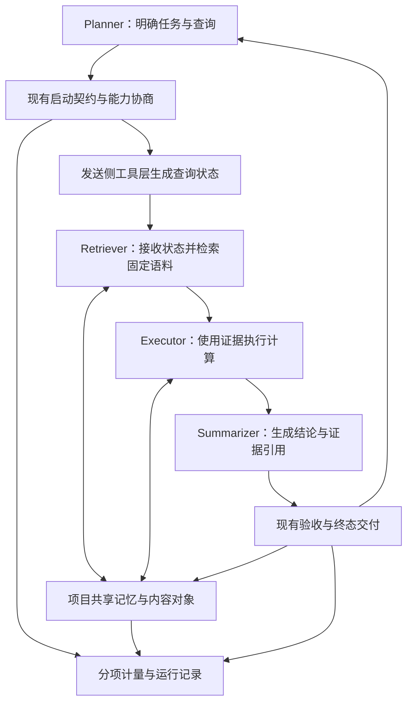

# pi-agent-share — 多智能体共享协作扩展 v1 Spec

版本：v1.1

日期：2026-09-15（v1.0 初稿）／2026-09-15（v1.1 修订）

状态：**已审阅确认的实施依据**；未实施、未取得运行验收结果。

范围：基于 Pi 0.85.1 与工作区 pi-subagents 的同机多 Agent 协作扩展。

规范级别：“必须/不得”为 v1 验收约束；“建议”为可在评审中调整的产品目标；“后续”为 v1 外能力。

## 修订记录

| 版本 | 变更 | 依据 |
|---|---|---|
| v1.0 | 初稿，合并前期改造设计与赛题符合性讨论 | — |
| v1.1 | 残差由“v1 外可选”改为 **v1 必交付**（§2、§8.3、§11、§12）；openEuler SP3 由 P0 硬门禁改为 **已知欠债**（§1.1、§11、§12）；嵌入 provider 定为**硅基流动 `BAAI/bge-m3`** 并细化线格式与确定性纪律（§4、§8.1、§8.2）；CodeAct **明确不实施**（§11）；对照矩阵规模分配冻结（§10.2、§10.3）；新增语料切块与实验驱动方式（§10.3） | 2026-09-15 设计访谈定案，见 [ADR-0001](../adrs/0001-residual-in-v1.md)、[ADR-0002](../adrs/0002-defer-openeuler-verification.md) |

产品名称：**pi-agent-share**（用户已确认）；中文描述：“共享证据、状态与记忆的多智能体协作”。**SYNAPSE** 保留为底层机制名称。包名尚未核查占用，发布时可加 npm 作用域，不影响产品名称。

## 1. 目的、依据与决策

本 spec 将此前改造设计和赛题符合性讨论合并为一个可追踪的产品与系统契约，作为分批实施计划的依据。v1.1 起本文为**已确认的实施依据**，实施按 §12 的批次推进；文中所有验收项在产生实际证据前一律为未验收状态。

产品让同一项目中的 Agent 共享可验证证据、查询状态与经验，在完成相同任务时减少重复表达和重复计算。Pi 负责模型会话与工具，pi-subagents 负责委派及监督，SYNAPSE 负责新增通信、状态和记忆机制。主会话保持最终决策权。

### 1.1 基线

| 项目 | 冻结依据 |
|---|---|
| Pi | 本机已核实 `@earendil-works/pi-coding-agent@0.85.1` |
| 开发机 Node | `v24.11.1`（已核实）；SP3 目标运行版本随 openEuler 验证一并暂缓，日后偿还欠债时确定并写入环境记录 |
| pi-subagents | `0.67.0`，提交 `47bae7f78d4a6993fd620963a9ecc1aceff4802f`；实现基座为该提交，不能仅按包版本推断能力 |
| Python SYNAPSE | 作为机制参考和一致性 fixture 来源，不作为 Pi 实验结果 |
| 赛题 | 当前工作区 `竞赛赛题.md`，SHA-256：`b383080725a9e51969d9a8eea4e1aa77f89f7a3424229dee24b575a311ab8e12` |
| 嵌入服务 | 硅基流动 `BAAI/bge-m3`，1024 维，`POST https://api.siliconflow.cn/v1/embeddings`；免费档 2000 RPM / 500K TPM；单条输入上限 8192 token、单请求至多 32 条；`dimensions` 参数对该模型不可用 |
| 开发与实验环境 | Windows 11 + Node 24.11.1；实验通过 `pi --mode json` 真实 CLI 路径驱动 |
| 最终环境 | openEuler 24.03-LTS-SP3。**v1.1 起暂缓验证，列为已知欠债**：代码保持严格 POSIX 可移植纪律，但 AC-15 在本轮交付中一律标记为“未验证”，交付材料不得出现任何暗示已在 SP3 运行成功的表述 |

M1–M11 是本项目对赛题“具体要求”按顺序添加的追踪编号，不是官方新增条款。运行原型须满足 M1–M10 及指定环境；CodeAct 为鼓励项。赛题没有要求多模型、多进程或自行开发全部运行时。

### 1.2 已选择的架构

| 方案 | 取舍 | 决定 |
|---|---|---|
| 在 pi-subagents 中加入 TypeScript 协作模块 | 能覆盖共有启动、子会话与后台交付，维护少量上游接缝 | 采用 |
| 独立 extension 仅调用公开委派 API | 易分发，但难覆盖内部交接和后台完整路径 | 不作为 v1 集成方式 |
| Python 常驻 sidecar | 可复用旧实现，但增加进程管理与部署成本 | 后续按实际 IPC 收益决定 |

保留上游许可与来源，发布说明区分复用和新增能力。功能默认显式启用；v1 不改已有 subagent 的成功判定、权限语义或取消机制。

## 2. 范围与非目标

### 2.1 v1 必须交付

- 同一个固定工作流支持纯文本和 SYNAPSE 结构化协作模式。
- 至少 3 个实际 Agent 实例协作，覆盖规划、检索、执行、总结中的至少 3 类角色。
- 前台和本机后台子任务使用一致的内容引用、记忆及结果交接语义。
- 项目范围内持久化、可检索、带来源版本的共享记忆。
- 二进制查询向量在不同 Agent 间交接，由接收方检索器实际消费。
- 能力登记与表示选择、状态校验、明确失败或有记录的恢复。
- **预测残差编码的最小实现**（见 §8.3）：正确编解码、预测基可重建、校验失败可回退完整向量、全链路分项计量，并在至少一个受控条件下证明净收益为正。
- 完整分项计量、两组关联连续任务及交付材料。

### 2.2 v1 外能力

跨主机共享、Herdr 远程状态、跨 worktree 自动复用、Python sidecar、Socket/memfd、eBPF、通用向量数据库、自动训练预测模型及全局历史压缩均不属于 v1。

**openEuler SP3 验证暂缓**，不属于本轮交付范围（§1.1）。**CodeAct 明确不实施**（§11）。

残差在 v1.0 中曾列为 v1 外的可选 P4 增量；**v1.1 起改为必交付**，理由与代价见 [ADR-0001](../adrs/0001-residual-in-v1.md)。它仍作为独立批次 P4 实施，但不再是“可裁剪项”。

不将长向量或 base64 载荷放入 LLM 提示词。不复用 smolagents 运行时，不据此沿用 CodeAct/沙箱能力声明。只允许缓存明确声明纯函数的工具结果；不跳过测试、构建、写操作或需要实时数据的调用。

已有角色 MEMORY.md 继续保存角色说明；SYNAPSE 的跨角色证据层不覆盖这些文件。原版插件已有的文件引用、缓存和精简 fork 必须保留为产品对照能力。

## 3. 工作流与系统边界

日常工作仍从原有 `subagent` 工具和 workflow 入口开始。比赛提供固定的四实例 profile：主 Pi 为 Planner，三个子 Agent 分别为 Retriever、Executor、Summarizer；使用相同或不同模型不影响实例计数。日常任务无需强制启动所有角色。

**不变量 INV-01：** 一个会话承担多个角色仍只计一个 Agent；日志须包含实例/session ID 和角色。

**不变量 INV-02：** 新增模块不得拥有第二套任务状态机。成功、失败、取消、超时和验收结果以 pi-subagents 最终终态为准，不能依据一次 `agent_end` 或模型自述完成来提交成功记忆。

**不变量 INV-03：** 共享对象必须在收方的授权范围内、可实际读取。前台 JS 对象可达不代表后台进程可达；文件 CAS 不宣称共享内存或网络传输。

### 3.1 正常任务

1. 宿主解析模式、任务与权限，冻结初始证据、语料版本及表示契约，形成 launch snapshot。
2. Planner 委派检索；发送侧嵌入查询并发布向量对象，消息只携带其状态引用和契约。
3. Retriever 根据交接状态引用读取实际字节、验证并查询已冻结的语料；接收侧不得使用发送方局部向量对象作为旁路。
4. 相关证据形成短摘要与引用；Executor 按需读取并执行任务，Summarizer 引用支撑结论的材料。
5. 宿主先保存完整结果和最终验收状态，再返回紧凑回执，提交有来源的记忆记录。
6. 后续任务在新的快照中读取前序记忆；本任务运行中产生的新记忆不悄悄改变已冻结的输入集合。

### 3.2 来源更新

来源指纹发生变化时，旧内容仍可用于显式历史查询，但不能标为当前有效证据。当前任务需要该证据时从新来源读取；无法重新验证时报告 unavailable。未提交的源码修改同样使旧指纹失效，不能只检查 Git commit。

## 4. 模式、配置与默认行为

模式在一次 workflow/run 开始时冻结，不能在运行中切换。生产默认 `off`，比赛/演示配置显式使用 `synapse`。

| 模式 | 协作材料 | 跨任务记忆 | 状态路径 |
|---|---|---|---|
| `off` | 原版插件行为 | 不新增 SYNAPSE 记忆 | 无新增交换；用于产品基线 |
| `text` | 合理精简的文本任务及文本结果 | 由 memory 配置明确决定 | 不交换向量，接收方按需要自行嵌入查询 |
| `synapse` | 动作/参数/类型化结果/证据引用 | 默认 `project` | 对检索任务交换完整向量；其他动作无需向量 |

text 模式允许底层用 JSON 运输文本，但语义交接不能借用 SYNAPSE 状态引用来隐藏正文成本。宿主仍可保存 artifact；text 基线实际交接的必要正文必须计量。

本节定义待实现的逻辑配置；实现时并入现有 config 解析入口，严格拒绝未知值。

| 配置 | 取值与默认 | 契约 |
|---|---|---|
| `synapse.mode` | `off / text / synapse`；默认 `off` | mode=off 不注册新工具或新增存储 |
| `synapse.memory` | `off / project`；synapse 默认 project，text 默认 off | 实验显式指定；memory=off 仍允许任务内临时证据，不跨任务保留 |
| `synapse.embedding` | 显式 `provider` / `endpoint` / `model` / `dim` / `keyEnv`；v1 值为 `siliconflow` / `https://api.siliconflow.cn/v1/embeddings` / `BAAI/bge-m3` / `1024` / `SILICONFLOW_API_KEY` | 这四项进入 `representationId`，必须可复现可审计，**不得存放在用户私有密钥文件中**；不继承一个未经验证可用的聊天凭证；密钥不写入任何记录 |
| `synapse.storageRoot` | 绝对路径；默认 `~/.pi/agent/synapse/<namespaceId>/` | **实验必需项**：每条实验序列必须指定独立的空存储根，并将该路径写入运行记录（§10.3） |
| `synapse.contextBudgetBytes` | 默认 8192 UTF-8 B | 限制自动注入的记忆摘要/引用，不截断用户任务和关键约束 |
| `synapse.maxObjectBytes` | 默认 1 MiB | 超限对象显式拒绝；既有完整输出路径继续适用 |
| `synapse.stateRecovery` | `resend / resend-then-text`；默认 resend-then-text | 最多一次可信原对象重传；后者允许随后一次文本查询重嵌入；权限/表示不兼容错误不走该恢复 |

完整向量固定为第 8 节格式。残差配置在 P4 落地前不暴露；P4 落地后其量化参数来自 §8.3 的标定产物，不接受手工填写的未标定值。

缺少 embedding 时关键词记忆能力可以使用，但检索状态能力必须标为 unavailable；显式请求状态检索则在启动前失败。**不得静默使用 hash 模型冒充真实语义模型**：测试用确定性伪向量 provider 只在 test 目录导出，配置解析必须严格拒绝其 provider 名。

**API Key 解析顺序**：环境变量 `SILICONFLOW_API_KEY` 优先且不可被覆盖；缺失时读取 `/synapse-setup` 斜杠命令写入的本地密钥文件（权限 600，仅存 key）。这样 CI 与实验脚本可完全不依赖落盘密钥。

**P1 阶段的检索**：嵌入在 P3 才接入，P1 的 `synapse_read.search` 使用确定性关键词（词集合 Jaccard）与标签相似度按 0.6 / 0.4 加权，返回结果必须显式携带 `semantic: "unavailable"`。不使用 BM25——其 IDF 随记忆库增长漂移，会破坏 §10.1 要求的可复算性。

记忆注入超预算时仅选择能完整放入的记录，排序相同时按 ID 固定排序，并标记有未注入候选。按需 get 的成本另计。任务不得因自动摘要预算而失去用户给定的范围、验收或失败原因。

## 5. 模块与接入契约

新逻辑集中在 `pi-subagents/src/synapse/`，以下为职责边界而非强制文件数。实现者须能单独测试每个模块。

| 模块 | 输入 | 输出/职责 | 依赖 |
|---|---|---|---|
| 协作适配 | 原有 delegation、权限、模式 | 能力记录、冻结快照、结果投影 | 现有 launch 与终态机制 |
| 内容与记忆 | 已授权正文、来源、版本 | CAS 引用、不可变记录、读取/失效结果 | 本机文件系统 |
| 状态交换 | 查询、表示契约、固定语料 ID | 二进制状态引用、恢复向量、检索候选 | 显式 embedding 适配及内容库 |
| 计量/评测 | 实际执行事件、模型 usage、题目结果 | 可复算运行日志、对照报告 | 不驱动任务路由 |

现有接缝：

- `src/extension/index.ts` 与 `config.ts`：注册及配置。
- `src/runs/shared/child-launch.ts`、`child-runtime-config.ts`、`child-hooks.ts`：共有前台/后台启动及实例化注入。
- `src/runs/shared/child-tool-plan.ts`、`capability-ceiling.ts`：读写工具和访问范围。
- `src/shared/launch-contract.ts`：将 SYNAPSE 影响启动的值纳入版本化摘要投影，前置校验与执行使用同一冻结值。
- `src/runs/shared/effective-system-prompt.ts`：仅稳定工具规则；动态证据放任务材料。
- `src/runs/shared/single-output.ts`、`chain-outputs.ts`：完整输出和有类型交接。
- `src/runs/foreground/execution.ts` 与 `src/runs/background/` 的 runner、notify、delivery ownership：完整结果、终态与通知去重。
- `src/api/delegation.ts` 和对应 schema/归一化：同步类型化扩展。

不得只在父会话 `tool_result` 中实现压缩并声称覆盖后台/工作流内部交接。不得把新工具加入 child hooks 后继续沿用未经复核的 readonly 证明；如果不符合现有只读快速路径，必须使用普通执行路径并测量其代价。

## 6. 协议与对外接口

### 6.1 任务侧接口

保留现有 `agent`、`task`、`context`、`cwd`、model/timeout/toolBudget/result 等字段。新增内容放在 `synapse` 子对象中，避免与原有管理 `action` 混淆。

| 调用方字段 | 规则 |
|---|---|
| `synapse.action` | `delegate / retrieve`；省略时 delegate；retrieve 必须选择声明状态检索能力的接收方 |
| `synapse.contextRefs` | 证据 ID 数组，默认空；最多 32 项，去重后宿主逐项验证权限和可用性 |
| `synapse.query` | retrieve 必需，非空 UTF-8 文本，至多 16 KiB；delegate 不接受 |

模型不得指定 namespace、sourceAgent、认证信息、预测基权限或任意状态对象路径。候选引用可由模型选择，实际权限由宿主判定。typed API、直接 subagent 调用、workflow、后台持久化、重试/恢复及 preflight 必须执行相同规则。

### 6.2 宿主生成的内部信封

信封绑定原有 requestId/ownerRunId/nodeId/runId/attempt 与 sender/receiver session ID，包含动作和输入参数；响应包含原有终态及结果。能力声明作为注册阶段消息单独保存，后续引用其 ID。

| 字段 | 含义与检查 |
|---|---|
| `protocolVersion` | v1 固定 1；不认识的版本拒绝 |
| `namespace` | 宿主按规范化仓库/worktree 路径确定的范围 |
| `snapshotId` | 输入记录、语料版本、权限投影与能力契约的不可变快照 ID |
| `capabilityId` | 已实际注册的 action/encoding/consumerVersion 能力记录 ID |
| `contextRefs` | 通过权限/版本校验的记忆引用 |
| `stateRef` | retrieve 使用；包含 payloadId、representationId、维度、字节长度和 SHA-256 |
| `corpusSnapshotId` | 收方固定检索语料；发送侧本轮不可追加候选答案 |

能力协商取双方支持的实际动作/表示交集，且受现有权限限制；向量路径必须同时满足表示契约一致和接收方存在检索消费工具。无共同能力时，在启动前显式拒绝，或在调用方允许普通文本委派的情况下返回有记录的文本路径；不能把文本结果计为向量成功。

### 6.3 模型可见工具

新增两个工具名，分别受现有读/写许可控制：

| 工具与动作 | 输入 | 返回与副作用 |
|---|---|---|
| `synapse_read.search` | query 或本任务已授权 stateId（二选一），可选 tags、k、includeHistorical（默认 false） | 候选 ID、摘要、来源、版本、分数；stateId 路径必须实际解码查询状态 |
| `synapse_read.get` | memoryId、可选 offsetBytes/limitBytes、allowHistorical（默认 false） | 校验后的正文范围、版本与 nextOffset；多字节边界不得损坏 UTF-8 |
| `synapse_write.remember` | topic、summary、content、kind、来源引用、tags | 宿主验证来源后生成 memoryId；标记为 observation 或 derived，不能自称已验收 |
| `synapse_write.supersede` | 旧/新 memoryId、原因 | 验证同来源演化链与写许可后追加取代事件，不覆写旧正文 |

k 默认 5、上限 20；get 默认返回最多 16 KiB；summary 最多 2048 UTF-8 B，正文受 maxObjectBytes 限制。模型输入中的身份、权限字段一律拒绝，宿主补齐真实身份。

索引/查询缓存由宿主管理，不赋予 read 工具修改业务文件或写入长期事实的权力。读取权限同时约束正文与搜索摘要，不能通过搜索越权内容获取摘要。

### 6.4 结果回执

沿用现有结果与终态，增加 `details.synapse`：snapshotId、完整输出引用、证据引用、摘要、持久化状态和计量引用。用户显式要求全文、file-only 或精确结构化输出时遵守原契约；只有选择紧凑交接的路径才替换模型可见正文。

完整输出写入并验证成功后才发布可用引用。存储失败则保留原始结果，标记 persistence failure；任务原本成功不代表记忆保存成功，任务原本失败也不能被摘要改写为成功。

优先使用子 Agent 已生成并通过 schema 校验的摘要。不自动追加总结模型；允许配置实验使用时，全部新增模型成本必须计入。

## 7. 记忆、内容库与有效性

### 7.1 数据模型

| 实体 | 必需信息 |
|---|---|
| ContentObject | SHA-256 ID、原始 bytes、长度、媒体类型 |
| MemoryRecord | memoryId、sourceAgent/session/run/attempt、createdAt UTC、taskTopic、summary、kind、contentId、tags、来源指纹、recordStatus |
| Supersession | 独立事件 ID、oldId/newId、原因与可验证来源变化、宿主身份 |
| Snapshot | 候选记录 ID、来源版本、corpus ID、权限投影、表示契约和 canonical digest |

kind 至少支持 evidence、tool-result、conclusion；策略记录作为明确未验证观察保存。正文去重不合并来源：两个 Agent 的相同内容可共享一个对象，但 provenance 记录分别保留。

memoryId 对规范化元数据（含内容 ID、宿主来源及逻辑操作身份）做 SHA-256；相同操作重试复用原始创建时间和 ID。并行的独立观察不得因为正文相同而丢失来源。

所有快照摘要使用确定性 JSON：对象键按代码点排序、数组顺序有定义、UTF-8、无多余空白、禁止非有限数字。不得依赖机器 locale 排序。新增契约摘要独立版本化，不悄悄改变上游旧摘要含义。

### 7.2 存储和并发

存储位于 Pi 用户目录的 SYNAPSE 项目命名空间：`~/.pi/agent/synapse/<namespaceId>/`，其中 `namespaceId` 为规范化绝对 worktree 路径的 SHA-256 前 16 位十六进制；目录内保存 `namespace.json` 记录该真实路径以便排查。后台启动契约携带已解析的绝对位置；不只凭 remote URL 合并不同检出，v1 不跨 worktree 自动共享。`synapse.storageRoot` 可覆盖该位置，实验中为必需项（§4）。

对象、记录、取代事件和快照均不可变，按 ID 分文件保存。写入在同目录临时文件完整完成后发布；发布记录前必须确认所引用对象存在且摘要匹配。读者忽略临时文件，发现孤立记录则显式失败；未被引用的对象可以留作后续清理。

不建设全局可变 JSON 数组索引。每个进程在启动/新任务边界加载有界候选，热路径从内存查询；v1 最多加载 1000 条记忆元数据（按 UTC 时间降序、ID 固定打破并列），显式 contextRefs 独立点读。冷启动和来源校验成本必须测量。

多进程发布冲突须验证同 ID 内容完全一致，否则按损坏拒绝。并发的新版本均可保留，存在分叉时标为 conflict，不根据时钟或相似度擅自选出“真值”。文件发布不承诺跨文件事务或断电持久性；依靠引用校验避免部分写入被消费。

v1 不自动删除对象；超过单对象大小限制或底层存储无法写入时拒绝新增并保留原任务结果。1000 条上限只限制每次加载的候选元数据，不是磁盘配额。清理作为后续显式操作，不在运行中删除快照引用。部署文档须说明存储位置、增长情况和手动保留策略。

### 7.3 有效性与权限

主检索默认只返回来源仍匹配的记录；历史查询必须显式选择历史版本，并在结果中带历史标记。检查时读取实际来源字节计算指纹，该次消费使用同一份已检查字节/内容对象，不能检查后重新读取另一份未经验证的数据。

无法确认来源时标为 unavailable；不得把旧测试报告当作当前通过证据。语义相似度只用于召回，不证明内容等价、事实正确或新版本取代。

共享记忆是数据，不能改变用户指令、Agent 工具白名单或权限。项目与子 Agent 授权范围相交后才允许读取。对于无法映射到现有访问策略的记忆，采取拒绝共享；不得因 mode=synapse 自动扩大权限。

此机制约束正常插件行为，不宣称隔离同用户的恶意代码或拥有任意 shell 权限的 Agent。

## 8. 非文本查询状态契约

### 8.1 v1 完整向量

发送侧对已声明查询调用 embedding，检查非空、维度正确、各值有限及范数非零，然后归一化。表示 ID 必须包含 provider 标识、模型及可用 revision、维度、归一化算法、序列化格式；provider 不提供 revision 时标记 unavailable，缓存限定实验批次，不能宣称跨版本一致。

v1 载荷为 **little-endian Float32，长度=4×dim**（bge-m3 为 1024 维，即 **4096 B**；该模型不支持 `dimensions` 降维，4096 B 是完整向量的固定成本）。完整 bytes 的 SHA-256 与信封声明一致。维度范围为 1–8192。转换后再次验证非零与有限数值。查询缓存键包含精确查询文本和表示 ID；正文与查询共用缓存时也必须遵守相同表示契约。

**线格式与确定性纪律**：调用 embedding API 时必须使用 `encoding_format: "base64"`（原始 float32 直传），不使用默认的 `"float"`——后者经 JSON 十进制序列化会改变低位，而这些低位正是残差量化标定的输入。**查询一律单条发送**（batch 组成会影响批推理输出）；语料嵌入按固定分批，分批方案进入 `corpusSnapshotId`。不使用未经真实向量验证的固定量化网格——量化粒度与分量数由标定脚本在录制的真实 bge-m3 向量对上扫描得出，冻结进配置并提交标定报告。

服务端是否归一化未见官方说明，发送侧**无论如何自行归一化**；首次接入时须实测 ‖v‖₂ 并记录。厂商不保证跨调用比特级可复现（无 `seed` 参数、文档无相关承诺），因此 golden fixture 的断言使用容差（余弦 ≥ 0.9999 或逐元素 `atol=1e-5`）而非精确相等。

**摘要语义（v1.1 澄清）**：`stateRef` 中的 SHA-256 校验的是**发送方实际发出的那串字节**，而非“该文本的嵌入结果”。二者的区别在文本回退路径上显现——接收方重新嵌入原查询所得向量与原摘要不符是**正常且预期**的，必须记为 `text-fallback`，不得报告为完整性失败。

接收方仅从 stateRef 读取载荷、验证并恢复向量；在指定 corpusSnapshotId 中执行余弦检索，返回固定排序的 top-k（同分按证据 ID 排序）。不在主路径重新嵌入原查询，不访问发送方局部变量，也不把向量放入 LLM。

固定语料独立于本轮发送行为：预加载版本或此前合法任务形成的语料可用；本轮为通过测试而写入预期答案不可用。

### 8.2 失败与恢复

| 条件 | 行为 |
|---|---|
| 对象缺失/截断/摘要不符 | 不消费；从发送方仍可验证的原对象重传一次，并计量 |
| 表示 ID、维度或 corpus 不兼容 | 不执行向量检索；返回兼容性错误，不能悄悄换模型 |
| 重传失败 | 若预先允许文本恢复且查询来源可信，收方重新嵌入并记录 text-fallback；否则失败 |
| 未授权 stateRef/错误 run 身份 | 拒绝且不返回越权对象细节；不通过回退获取同一未授权内容 |
| 取消/超时 | 中止嵌入、对象重试和检索准备，遵守原预算；迟到结果不得更新终态 |

原始查询作为受控恢复材料保存，正常路径不注入接收方模型上下文；恢复取回、重新嵌入和模型读取分别记账。每个失败请求的重传最多一次、文本恢复最多一次，不产生无界循环。

完整性摘要发现字节损坏，不认证恶意发送者。接收方没有原始 Y 时不能声称独立计算了原始与恢复向量余弦。检索和答案质量必须独立评测。

### 8.3 残差最小实现（v1 必交付）

完整向量路径（P3）通过验收后，才独立设计/实施残差格式与量化参数（P4）。要求预测基版本可重建、把基同步成本算入、比较完整信封+载荷、失败可回完整向量。**预测基策略为 `query-top1`**；oracle 仅作独立研究对照，不得作为主实现或用于报告收益。

**验收底线（v1.1）**：机制达标（正确编解码、基可重建、校验失败可回退、全链路计量齐全）**且在至少一个受控条件下证明净收益为正**。受控条件指同一主题的高相似度连续查询——即 G1/G2 序列第 2 轮及以后，预测基与目标向量初始余弦较高的场景。正常任务路径仍以完整向量为准；残差在何种条件下成立，必须作为结论的一部分如实报告，包括不成立的条件。

**标定标准为检索一致性**：以“用恢复向量检索所得 top-k 与用真实向量检索完全一致”为验收判据，余弦仅作辅助诊断指标。不使用未经真实向量验证的固定量化网格——量化粒度与分量数由标定脚本在录制的真实 bge-m3 向量对上扫描得出，冻结进配置并提交标定报告。

**标定集隔离**：标定脚本在 P3 末录制向量、P4 初运行；标定使用 G1/G2 各自的**预留轮次**，与参与最终统计的轮次严格分开，不得在评测集上调参。

不以节省向量字节推断节省 Token。Python 版 SYNAPSE 的历史数字仅作“该机制在何种条件下成立”的先验，**不得引用为本项目成果**。

## 9. 生命周期与错误语义

宿主在 preflight 后冻结已验证输入，执行使用相同值；来源后来失效时记录此次消费拒绝和显式补取，不偷偷替换快照。新快照必须有新 ID 并入重试/恢复轨迹。

session reload、fork 和 resume 重建实例化 hooks；后台只持久化 JSON 数据和对象引用，不保存函数、活跃 ctx 或主进程内存对象。重建后重新验证 namespace、权限及对象可用性。

`remember` 记录可在任务内提交为 observation，任务最终失败时保留来源状态，不升级为成功经验。自动 conclusion 必须在上游最终验收之后提交。子工具执行成功不等于父任务验收成功。

重复回执按原有 delivery owner 和 run/node/attempt 身份处理；相同逻辑记忆提交幂等，但真实重试的模型、I/O 和耗时不能去重掉。内存缓存不得跨权限范围复用未过滤的候选摘要。

错误类别固定为 configuration、permission、source-stale、object-unavailable、integrity、representation、persistence、cancelled/timeout。映射到现有任务终态并附加 details，不新增与上游冲突的 success 状态。

## 10. 计量与可复现实验

### 10.1 事件与公式

事件包含 schemaVersion、eventId、run/node/attempt、agent/session、模式、snapshot、单调耗时及 UTC 时间。状态的 prepare、send、receive、consume 分开记录，consume 才证明使用；send attempt 与成功交付分开计数。

| 指标 | 定义 |
|---|---|
| 消息次数 | 每个唯一 messageId 的成功应用层交付计一次；重试以新 attempt 单列；接收日志不再次累加发送消息数 |
| 文本开销 | 实际 Agent 间交接文本的 UTF-8 字节；字符数按 Unicode code point；只有指定 tokenizer 时才另报通信 Token |
| 模型 usage | 实际 provider 报告的父/子 input/output/cacheRead/cacheWrite/cost；按 provider 语义解释，缓存不可重复加总 |
| embedding | API 请求、输入 Token、缓存命中、耗时、费用；包含冷索引构建和回退 |
| 非文本次数/规模 | 发送的状态次数与二进制 bytes；失败尝试和恢复另列；仅传记忆 ID 不计为向量载荷 |
| 存储/控制 | 对象读写字节、元数据/信封字节分别计；没有 Socket 时 transport 标记 N/A |
| 单任务总耗时 | 从接受任务到最终交付，包含准备、排队、工具、校验和回退；嵌套并行耗时不简单相加 |
| 记忆命中率 | 返回至少一个授权且有效候选的查询数/全部记忆查询；零查询报告 N/A |
| 复用效果 | 实际读取、跨 Agent 后续任务引用、金标验证有效率、陈旧拒绝与避免的纯计算调用分别报告 |

缺失 usage 是 null/unavailable，不是 0。只有所有必要 usage 齐备时计算该运行的 Token 节省；失败任务仍记录已发生费用。总节省按“1−实验组总量/基线总量”计算，基线为零则 N/A，不平均每题百分比冒充总体节省。

保留代码 SHA、依赖锁哈希、Pi/Node/OS、任务/语料哈希、模型/服务标识、配置、seed、执行顺序、逐轮预测、证据和失败。原始记录只追加，聚合输出可重新生成。未来答案不进入初始记忆。

### 10.2 对照矩阵

| 组 | 条件 | 用途 |
|---|---|---|
| T0 | 同工作流 text，跨任务 memory off | 明确定义的纯文本赛题基线 |
| S0 | synapse 类型化交接，memory off，文本查询在收方嵌入 | 协议贡献消融；只在实验配置提供，不声称使用向量交换 |
| S1 | S0 + project memory | 共享记忆贡献 |
| S2 | S1 + 完整查询状态交换 | v1 参赛主实现 |
| T1 | text + 与 S2 相同可见记忆/语料/权限 | 强文本基线 |
| U0 | 未改造的 pi-subagents，合理使用原有 fork/文件/记忆能力 | 产品增量对照，不能替代 T0 |
| R1 | S2 + 残差 | v1 必交付的残差路径（§8.3） |

**规模分配（v1.1 冻结，实验前不得调整）**：主对照 **T0 / S2 / R1 各 5 条独立序列**，消融 **S0 / S1 / T1 / U0 各 2 条**，两个任务组合计约 300 轮。报告必须明示各组样本数与消融组降规格的理由；消融组只作趋势说明，不单独宣称统计显著。

赛题主对照 T0/S2 保持同一角色、模型、初始资料、目标和工具权限；归因看相邻消融及 T1。单测协议时固定证据选择。两条模式保留合理精简的文本，不人为膨胀 T0，不改变完整回答的验收要求。

固定工作流可使用相同 fresh 策略以隔离通信因素；产品对照另测上游合理的 fork/pruned fork。任何策略差异必须写入配置，不把减少继承历史的收益全归于状态协议。

### 10.3 任务、统计与发布判断

G1：固定代码/技术资料的调查、证据组合、计算、资料更新与历史查询。G2：版本化日志的解析、统计、相关追问、输入变化与策略复用。每组一条 10 轮序列是最低演示；正式实验的序列数按 §10.2 的冻结分配执行，每条 10 轮。两组每条各 10 轮是本项目加强验收，不冒充赛题逐组规定。

**语料来源（v1.1 定案）**：G1 使用 **Python SYNAPSE 仓某个冻结 commit 的只读快照**，与开发工作区物理隔离，避免“被测语料同时是被改代码”。切块按**文件为单位**，超过嵌入长度上限的文件用**固定行数窗口 + 重叠**兜底；窗口行数与重叠行数进入 `corpusSnapshotId`。不使用语法解析切块——切块质量不是研究对象，而“给定 commit ⇒ 唯一确定的切块集合”是可复现性的前提。G2 使用**脚本合成的版本化日志**，金标由生成器参数直接导出，并用于精确构造 AC-07 的来源失效场景。

**模型分配**：四个角色统一使用同一模型（v1 为 `deepseek-flash`），模型 ID 与版本写入 manifest。赛题考察协作机制而非模型搭配，引入模型差异只会污染归因。

**实验驱动方式**：正式实验必须走真实 CLI 路径，每轮 spawn 一个 `pi --mode json` 子进程，配独立的 `PI_CODING_AGENT_DIR` 与独立的 `synapse.storageRoot`。其 JSON Lines 事件流直接归档为原始记录、事后重新聚合，满足 §10.1“原始记录只追加，聚合输出可重新生成”。进程启动与扩展加载开销计入单任务总耗时。编程接口 `createAgentSession` 只用于单元与集成测试，不作为实验路径——实验里跑的必须与用户实际使用的是同一条路。

每轮有确定输入和金标检查项：证据 ID/来源正确、数值结果容差、版本选择及输出契约。先冻结评分脚本和任务，再运行模型。独立序列按 seed 随机采用 AB/BA 顺序，两组各自从隔离的空记忆开始并顺序累积，不能逐轮随机打乱相关序列。

报告配对序列级 bootstrap 95% 区间（10000 次重采样、固定分析 seed），分别展示两组结果和样本数。序列内各轮不当作独立样本。正确性分数归一化到 0–1；本 spec 建议产品非劣界为 Δquality≥−0.02，以区间下界判定，区间不足则报告 inconclusive。这个界限为待审阅的项目标准，不是赛题官方阈值；实验前冻结后不得看结果再放宽。

工程验收与性能结论分开：机制通过并不代表必然省 Token。只有对照下真实成本下降且质量满足预设条件，才宣称效率提升；否则报告负结果和适用范围。前台状态刷新与 token 流式回调不得新增 embedding、目录扫描或全量记忆重建。

## 11. 验收矩阵

所有项初始状态均为未验收，以下是执行后必须产生的证据。

| ID | 条件/干预 | 通过标准 | 赛题 |
|---|---|---|---|
| AC-01 | 固定多步骤工作流 | 至少 3 实例、3 类角色实际执行，身份与结果可追踪 | M1 |
| AC-02 | 改变接收方声明的动作/表示能力 | 协商实际改变路径或拒绝；动作、参数、结果、能力样本齐全 | M2 |
| AC-03 | 同任务切换 text/synapse | 两模式都可运行，配置及实际材料差异可核对 | M3 |
| AC-04 | 不同 Agent 交接 Float32 查询状态 | send→receive→consume 完整；解码向量驱动固定语料检索 | M4 |
| AC-05 | 以预设另一查询向量替换状态 | 检索按 fixture 预期变化；禁用解码不能继续报告状态成功 | M4 |
| AC-06 | A 写入、B 后续任务搜索/get/引用 | 必需元数据齐全；重建进程可读；实际复用记录存在 | M5/M6 |
| AC-07 | 更改来源文件/日志，包括未提交修改 | 旧记录不作为当前有效证据；必要读取/计算重新执行 | M6 |
| AC-08 | G1/G2 连续序列 | 两组各至少 10 轮无未处理崩溃；成功/失败/恢复均有记录 | M7/M9 |
| AC-09 | 事件聚合、后台回放与重试 | 消息/字节计数守恒；真实重试成本保留；缺失 usage 不作零 | M8 |
| AC-10 | 前台/后台执行同一输入 | 权限、快照、引用和错误语义一致，结果交付不重复 | M9 |
| AC-11 | 截断、摘要错误、维度错误、对象消失 | 不消费损坏状态；按有限恢复链完成或明确失败 | M4/M9 |
| AC-12 | 只读角色/跨项目访问/非法路径 ID | 未授权写入与读取均拒绝，搜索摘要也不泄漏 | 系统边界 |
| AC-13 | 两进程并发写、发布前终止、存储满 | 没有部分正文被接受；独立 provenance 不丢；原结果保留 | M5/M9 |
| AC-14 | cancel/reload/resume/失效快照 | 不新增成功终态或无限重试；重新校验后才可继续 | M9 |
| AC-15 | SP3 干净环境复现 | 固定版本构建/加载、前后台运行、测试及 OS 证据齐备。**v1.1 起暂缓，本轮一律标记为“未验证”**（§1.1、[ADR-0002](../adrs/0002-defer-openeuler-verification.md)） | 环境 |
| AC-16 | 交付材料检查 | 源码、设计、部署、实验、视频齐全；上游与新增能力可区分 | M10 |
| AC-17 | 残差编解码、基重建、校验失败回退、高相似度连续查询条件 | 编解码正确且基可重建；损坏或不兼容时回完整向量且有记录；标定按检索一致性判据得出且标定集与评测集分离；在受控条件下净收益为正，条件不成立的情形一并如实报告 | M4／状态传递创新 |

**CodeAct 不实施**：赛题将其列为鼓励项，v1.1 决定不做，交付材料中如实说明未实现该项，不以 AC-01 的一般工具执行冒充。若将来实施，须另立生成 Python、执行、超时及隔离边界的独立验收。

## 12. 分批交付与实现计划边界

本文件是整个 v1 的系统契约，不要求一次实现全部模块。后续按下面的依赖单独编写可执行计划；每批必须有清晰的完成不变量，避免把存储、runner 生命周期、公开 API 与算法改动揉进一个提交。

| 批次 | 范围 | 核心门槛 |
|---|---|---|
| P0 | Pi/Node/上游版本基线 | 本机 `npm ci --ignore-scripts`、typecheck、单元与集成测试全绿；`pi -e <路径>` 实际加载扩展并完成一次前台、一次后台最小委派；未通过不得扩张后续范围 |
| P1 | 文件 CAS、共享记忆、读写工具与来源有效性 | AC-06/07/12/13 的前台闭环 |
| P2 | 显式 text/synapse、自动交接、后台一致性、共同计量 | AC-02/03/09/10/14 |
| P3 | 表示契约、完整向量交接、真实检索消费 | AC-04/05/11；**信封与表示契约必须为残差预留字段** |
| P4 | 残差格式、标定与增量实验 | AC-17；独立细化后比较完整向量 |
| P5 | 连续任务、正式对照和交付材料 | AC-01/08/16 及全部矩阵闭环（AC-15 除外，见 §1.1） |

**P3 对 P4 的硬约束**：P3 完成时，`representationId` 必须已带编码标识、`stateRef` 必须已带 `baseMemoryId` 与 `encoding` 字段，使 P4 只补算法而不改协议版本号、不动 P1/P2 的存储层。

P5 的任务 fixture、事件 schema 和评分脚本从 P1 开始准备。完整参赛交付为 P0–P5 全部批次；P1/P2 阶段可以演示记忆功能，但不得标为已满足所有赛题要求。

**工程纪律**：基座为 `pi-subagents` 的独立检出，改造在本地分支进行并正常提交，提交边界与批次边界对齐——不把存储、runner 生命周期、公开 API 与算法改动揉进一个提交。新增代码保持严格 POSIX 可移植纪律（路径拼接、大小写敏感、文件权限、rename 语义），以降低 SP3 欠债日后偿还的成本。门禁为 `tsc --noEmit` + 单元测试 + 集成测试 + oxlint（含 anti-slop 规则），每批全绿。上游 `test/smoke/npm-background.mjs` 仅在 Linux + bubblewrap 下运行，不计入 Windows 阶段的必过项。AC 锚定的行为测试先行，尤其是 AC-07 与 AC-12 这类否定性约束。

v1.1 的审阅已完成：v1 范围、模式默认值、读写与版本语义、质量非劣界与首个实施批次均已确认，产品名 pi-agent-share 已确认。依赖/模型具体版本属于实验运行 manifest，只有 P0/实验预注册通过后才形成已验证配置；本文不伪造环境成功或实测收益。

**本 spec 记录的已知欠债**：openEuler SP3 未验证（AC-15）；残差在完整向量仅 4096 B 且不可降维的前提下，绝对收益空间有限，净收益只在高相似度连续查询条件下可能为正；嵌入服务无比特级确定性保证，golden fixture 依赖容差断言。三项均须在交付材料中显式说明，不得淡化。

## 13. 依据与引用

本 spec 已包含必需约束，可独立用于设计审阅。此前工作区设计和赛题文件未必随本次 spec 提交纳入 Git；追溯时应同时保存相应工作区版本或其哈希，不将缺失的外部附件当作验收证据。

- [赛题原文](../../../竞赛赛题.md)
- [前期改造设计](../../SYNAPSE-Pi-Extension改造设计与实施计划-20260914.md)
- [赛题符合性与验收对照](../../SYNAPSE-Pi扩展赛题符合性与验收对照-20260915.md)
- [上游工作区约束](../../../pi-subagents/AGENTS.md)、[VISION](../../../pi-subagents/VISION.md)
- [委派契约](../../../pi-subagents/src/api/delegation.ts)、[共有启动](../../../pi-subagents/src/runs/shared/child-launch.ts)、[启动摘要](../../../pi-subagents/src/shared/launch-contract.ts)
- [子会话 hooks](../../../pi-subagents/src/runs/shared/child-hooks.ts)、[角色记忆](../../../pi-subagents/src/agents/agent-memory.ts)
